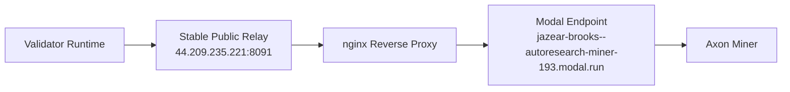

# Live Relay Showcase

This walkthrough is the strongest technical proof currently available for AutoResearch Network.

## What It Proves

- A stable public relay IP exists at `44.209.235.221:8091`
- The relay forwards to a live Modal backend at `https://jazear-brooks--autoresearch-miner-193.modal.run`
- Signed Bittensor Dendrite requests succeed through the relay
- A validator runtime completed a real round against the relayed miner
- Validator state updated from the miner response

## Architecture



## Terminal Proof

### 1. Confirm the miner advertises the stable relay

```bash
uv run --with bittensor-cli btcli wallet overview \
  --wallet-name my-miner \
  --wallet-path ~/.bittensor/wallets \
  --network test \
  --json-output \
  --quiet
```

What to show:

- `default` hotkey axon is `44.209.235.221:8091`

### 2. Show a signed relay probe returning success

```bash
python - <<'PY'
import asyncio
import textwrap
import bittensor as bt
from bittensor_wallet.wallet import Wallet
from autoresearch.protocol import ExperimentSubmission

BASELINE = textwrap.dedent('''\
import math
class GPTConfig:
    n_layer: int = 12
    n_embd: int = 768
    window_pattern: str = "SSSL"
UNEMBEDDING_LR = 0.004000
EMBEDDING_LR = 0.600000
SCALAR_LR = 0.500000
MATRIX_LR = 0.020000
TOTAL_BATCH_SIZE = 2**19
_ = math.sqrt(16)
print("---")
print("val_bpb:          0.997900")
print("training_seconds: 300.0")
print("total_seconds:    301.2")
print("peak_vram_mb:     24000.0")
print("mfu_percent:      39.80")
print("total_tokens_M:   60.0")
print("num_steps:        953")
print("num_params_M:     50.3")
print("depth:            8")
''')

async def main():
    wallet = Wallet(name='my-miner', hotkey='default', path='~/.bittensor/wallets')
    sub = bt.Subtensor(network='test')
    mg = sub.metagraph(193)
    dendrite = bt.Dendrite(wallet=wallet)
    syn = ExperimentSubmission(
        task_id='relay_probe_plausible_large',
        baseline_train_py=BASELINE,
        global_best_val_bpb=1.1,
    )
    resp = await dendrite.call(mg.axons[0], synapse=syn, timeout=120, deserialize=False)
    print('dendrite_status', getattr(resp.dendrite, 'status_code', None))
    print('axon_status', getattr(resp.axon, 'status_code', None))
    print('val_bpb', resp.val_bpb)
    print('hardware_tier', resp.hardware_tier)
    await dendrite.aclose_session()

asyncio.run(main())
PY
```

What to show:

- `dendrite_status 200`
- `axon_status 200`
- returned `val_bpb`
- returned `hardware_tier`

### 3. Show the validator state update

```bash
cat .validator-state-live/global_best.json
```

What to show:

- `val_bpb` updated from the miner response
- `achieved_by` set to the miner hotkey

## Current Caveat

This live path is proven with the miner temporarily accepting non-validator queries and zero stake
for testing. The remaining blocker to a strict validator-permitted proof is validator economics and
stake/permit, not ingress or request routing.
